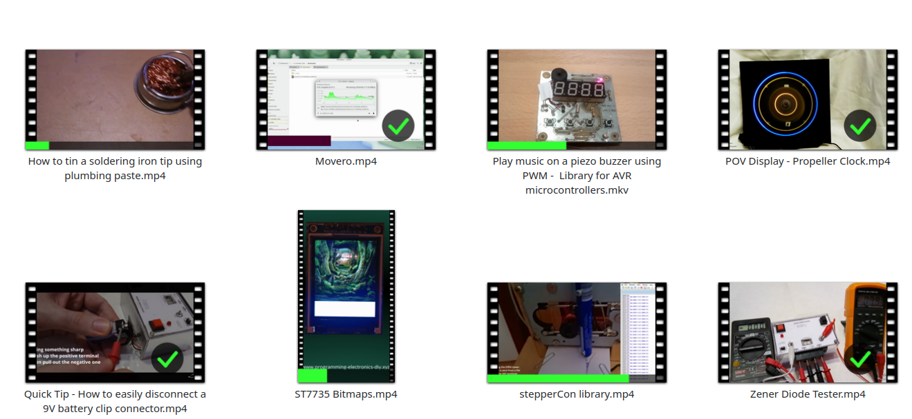

**MarkWatched** is a KDE Service Menu extension for the Dolphin file manager. It allows you to visually mark video files and folders as "Watched" or "Unwatched" directly from the right-click menu. It modifies existing thumbnails to overlay a checkmark or a progress bar and synchronizes with SMPlayer's watch history.

## Table of Contents

*   [Features](#features)
*   [Requirements](#requirements)
*   [Installation](#installation)
*   [Usage](#usage)
*   [Configuration](#configuration)
*   [Backup & Data Management](#-Backup-&-Data-Management)
*   [Dolphin Tagging & Sorting](#-Dolphin-Tagging-&-Sorting)
*   [Troubleshooting](#troubleshooting)
*   [Donations](#-donations)
*   [License](#-license)

## Features

*   **Mark as Watched:** Adds a green checkmark to the video thumbnail.
*   **Mark as Unwatched:** Restores the original thumbnail.
*   **Sync Progress:** Reads SMPlayer configuration files (`.ini`) to update thumbnails with:
    *   A progress bar (if partially watched).
    *   A checkmark (if watched > 90%).
*   **Folder Support:** Marks entire folders as watched by generating a custom icon and configuring the `.directory` file.
*   **Multithreaded:** Processes multiple files in parallel for fast performance.
*   **Visual Feedback:** Uses a native KDE progress bar (`kdialog`) during processing.

| Example of watch progress using MarkWatched |
| :---: |
|  |
| *Videos can be found on my [Youtube channel](https://www.youtube.com/@alientransducer5088)* |


## Requirements

*   **OS:** Linux with KDE Plasma (Dolphin File Manager)
*   **Python:** Python 3
*   **Python Libraries:**
    *   `Pillow` (PIL for image processing)
*   **System Tools:**
    *   `ffmpeg` (specifically `ffprobe`)
    *   `xdotool` (to refresh Dolphin)
    *   `rsvg-convert` (to generate folder icons)
    *   `kdialog` (for dialogs and progress bars)
    *   `qdbus6` (or `qdbus`)
    *   `setfattr` (for tagging)

### Installing Dependencies

It is recommended to use your system's package manager to install the required Python libraries (`Pillow`) and system tools. `pip` is not required if `python3-Pillow` is available in your repositories.

**OpenSUSE:**
```bash
sudo zypper install python3-Pillow ffmpeg xdotool rsvg-convert
```

**Debian/Ubuntu:**
```bash
sudo apt install python3-pil ffmpeg xdotool rsvg-convert
```

### Using a Virtual Environment (Optional) 
It is recommended to use system packages (zypper or apt), but if you prefer to use pip in an isolated environment:
1. Create a virtual environment inside the project folder:
```bash
python3 -m venv venv
```

2. Install dependencies using the venv's pip:
```bash
./venv/bin/pip install Pillow
```

3. Note: You must ensure `install.sh` is configured to use this virtual environment (e.g. set **PYTHON_PATH** to the **venv/bin/python3** path) before installing.

## Installation

1.  Clone or download this repository.
```bash
git clone https://github.com/silo0074/MarkWatched.git
cd MarkWatched
```

2.  Make the install script executable:
```bash
chmod +x install.sh
```
3.  Run the installation script:
```bash
./install.sh
```
*This script copies the `.desktop` file to `~/.local/share/kio/servicemenus/` and configures the paths.*

4.  **Restart Dolphin** to apply changes (doesn't seem to be necessary):
```bash
killall dolphin && dolphin &
```

## Usage

1.  Open Dolphin.
2.  Select one or more video files (or a folder).
3.  Right-click to open the context menu.
4.  Navigate to **MarkWatched** that can also be under **Actions**.
5.  Select an action:
    *   **Mark as Watched**
    *   **Mark as Unwatched**
    *   **Sync Progress from INI**
    *   **Export INI files**

**Note**: the script uses existing thumbnails. To make the system generate them, press F12 and cycle through the 3 views: **Icons** (CTRL+1), **Compact** (CTRL+2), **Details** (CTRL+3).

## Configuration

The script is currently configured to look for SMPlayer configuration files in the default location. You can modify the `mark_watched.py` file if your paths differ.

Look for the `--- CONFIGURATION ---` section in `mark_watched.py`:

```python
INI_BASE_PATH = os.path.expanduser("~/.config/smplayer/file_settings/")
MIN_THRESHOLD = 5.0   # % below which is "unwatched"
MAX_THRESHOLD = 90.0  # % above which is "watched"
VIDEO_EXTS = ('.mp4', '.mkv', '.avi', '.mov', '.webm', '.flv', '.wmv', '.mpeg', '.mpg')
```


## 💾 Backup & Data Management

MarkWatched includes a feature to backup your SMPlayer watch history (`.ini` files). This is useful for migrating to a new system or protecting your progress before a "BleachBit" or cache cleanup.

### Exporting Watch Progress
1. Select your videos/folders and choose **Backup Progress** from the menu.
2. **First Run:** You will be prompted by a folder picker to select your destination backup directory.
3. **Configuration:** Your choice is saved in `~/.config/markwatched/config.ini`.
4. **Changing the Backup Path:** If you wish to select a different backup folder later, simply delete the configuration file:
```bash
rm ~/.config/markwatched/config.ini
```
The next time you run a backup, the script will prompt you for a new location.

### Restoring Progress
If you reinstall your OS or lose your SMPlayer settings, you can restore your progress by copying the backed-up .ini files (and their subfolders) back to the SMPlayer config directory:
```bash
cp -r /path/to/your/backup/* ~/.config/smplayer/file_settings/
```

## 🏷️ Dolphin Tagging & Sorting
In addition to visual checkmarks on thumbnails, MarkWatched applies native KDE Tags to your files. This allows for powerful sorting and filtering within Dolphin.

### Displaying the Tag Column
To see which files are marked as "watched" in a list view:

* Open Dolphin and switch to Details View (Ctrl + 1).
* Right-click any column header (e.g., "Name" or "Size").
* Check the box for Tags.
* Click the Tags header to sort all watched files together.

### Using the Sidebar
Your watched files are also indexed by Baloo (KDE's file indexer).
You can find a **Watched** entry in the left sidebar under the **Tags** section.

**Note on Refreshing**: While the script forces a Baloo re-index, the Dolphin sidebar UI can sometimes be slow to update. If a recently tagged file doesn't appear on the left immediately, press **F5** or navigate away and back to the folder to refresh the view.


## Troubleshooting

*   **Thumbnails not updating?**
    *   Ensure you have enabled previews in Dolphin (press F12).
    *   The script attempts to refresh Dolphin using `xdotool` (F5), but you may need to manually refresh or clear the thumbnail cache if it fails.
*   **Sync not working?**
    *   Ensure SMPlayer is configured to remember file settings.

## ❤️ Donations

<a href="https://www.buymeacoffee.com/liviuistrate" target="_blank">
  
</a>

<br>


## 📄 License
This project is licensed under the [GPLv3](https://github.com/silo0074/MarkWatched/blob/main/LICENSE) License.